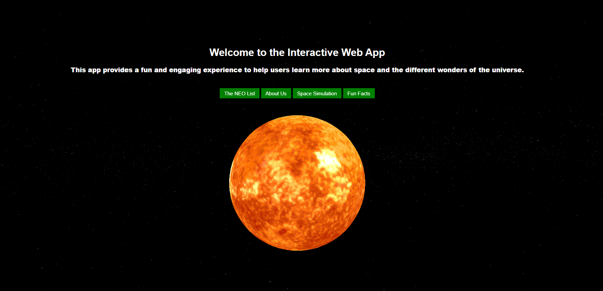
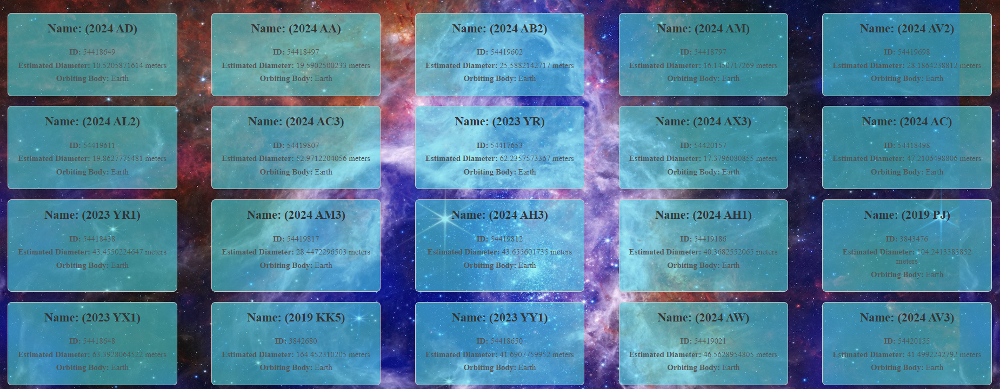
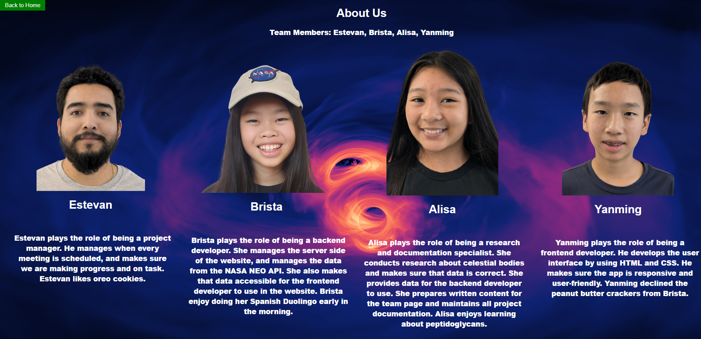
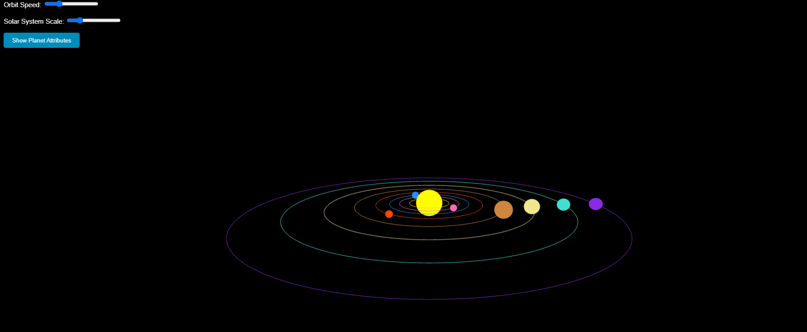
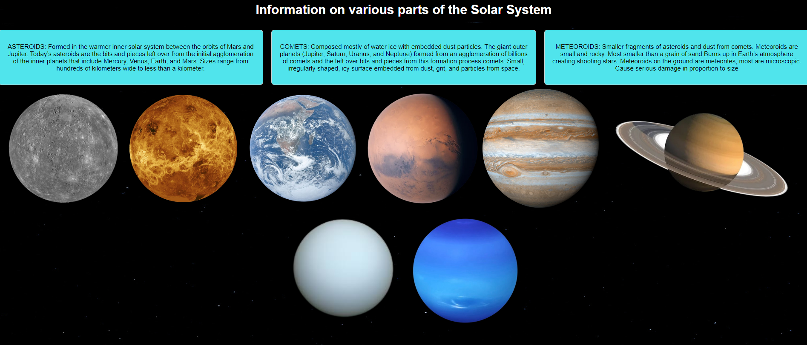
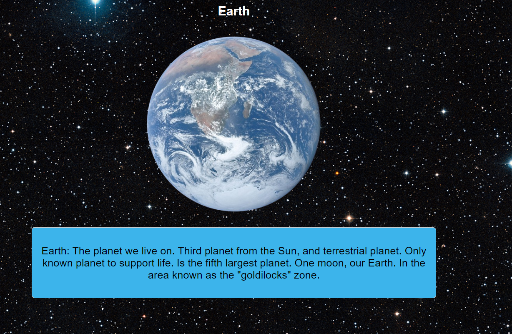

# Project Name

## Features

Here are some key features of the project:

1. **Orbit Simulation**:
   
   ##THis renders a sun in #D model and is spinning in the home page.

2. **NEO LIST FROM API**
   
   ## We generate this list with the data received from NEO API
   
4. **About Us**
   
   ## This page is about us

6. **SImulation Orrery**
   
   ##This simulation shows he planets and the table of the data from NEO API, it also has sliders to adjust.

8. **Fun Fact**
   
   Extra planets to learn from, they have hover effect and clickable

10. **Planet**
   
All planets have this, and are able to select it

